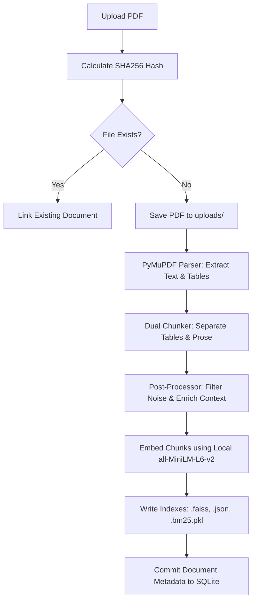
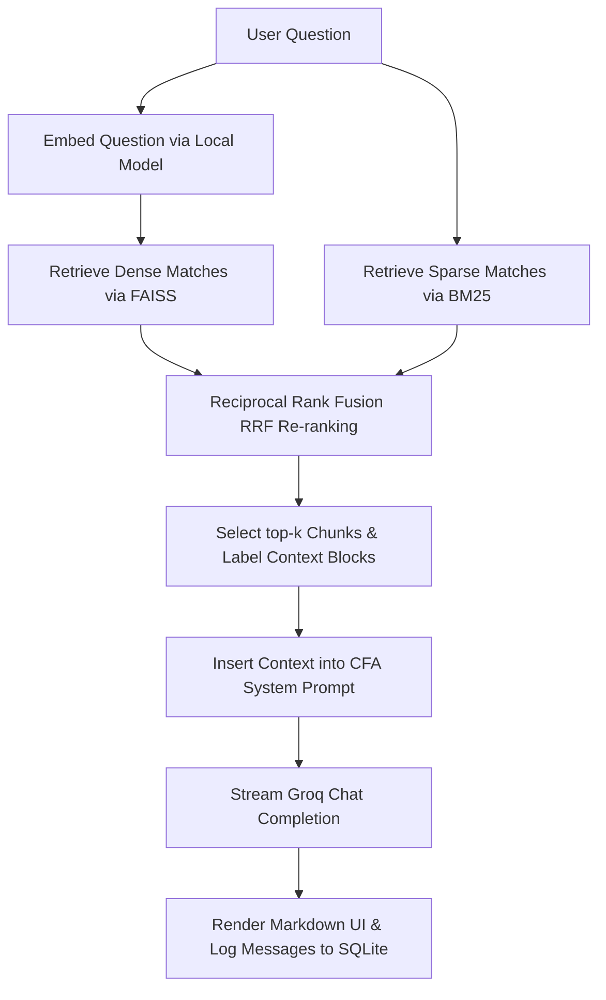

# Investment RAG + LLM-Based Analyzer

An industry-grade, production-ready document analyzer and Q&A engine designed specifically for financial and investment PDFs (such as scheme information documents, factsheets, key information memorandums, and credit decks). 

The system leverages **FastAPI** on the backend, a **Vanilla JS/CSS** dashboard on the frontend, and a custom **Hybrid Retrieval RAG pipeline** featuring dual-type chunking, automated chunk repair/enrichment, and Reciprocal Rank Fusion (RRF) search.

---

## Table of Contents
1. [Tech Stack](#tech-stack)
2. [Key Architecture Features](#key-architecture-features)
3. [Prerequisites](#prerequisites)
4. [Directory Structure](#directory-structure)
5. [Getting Started (Local Setup)](#getting-started-local-setup)
6. [System Architecture & Lifecycle](#system-architecture--lifecycle)
7. [Environment Variables Reference](#environment-variables-reference)
8. [API Documentation](#api-documentation)
9. [Troubleshooting](#troubleshooting)
10. [License](#license)

---

## Tech Stack

- **Backend Framework**: [FastAPI](https://fastapi.tiangolo.com/) (Asynchronous Python 3.11+)
- **WSGI/ASGI Server**: [Uvicorn](https://www.uvicorn.org/)
- **Database Engine**: [SQLite](https://www.sqlite.org/) with asynchronous [SQLAlchemy 2.0](https://www.sqlalchemy.org/) & `aiosqlite`
- **Authentication**: JWT (JSON Web Tokens) via `PyJWT` & Secure `Argon2` password hashing via `pwdlib`
- **RAG & Vector Storage**: 
  - [FAISS](https://github.com/facebookresearch/faiss) (Facebook AI Similarity Search - L2 Flat Index for dense vectors)
  - [Rank-BM25](https://github.com/dorianbrown/rank_bm25) (Sparse keyword BM25 retrieval)
  - Local [SentenceTransformers](https://sbert.net/) (`all-MiniLM-L6-v2` loaded locally - no external API dependencies for embedding)
- **PDF Extraction**: [PyMuPDF (fitz)](https://pymupdf.readthedocs.io/) with custom paragraph-grouping and fallbacks to `pdfplumber` or `pytesseract` OCR
- **LLM Integrations**: [Groq API SDK](https://github.com/groq/groq-python) (using models like `llama-3.3-70b-versatile`)
- **Logging**: [Loguru](https://github.com/Delgan/loguru) asynchronous structured logging
- **Frontend Dashboard**: Vanilla HTML5, CSS3 (sleek dark mode glassmorphism UI), and client-side JavaScript

---

## Key Architecture Features

### 1. Dual-Type Layout-Aware Chunker
Naive chunkers slice pages at arbitrary token lengths, destroying tables and references. Our system:
- Identifies tables on a page using **PyMuPDF TableFinder** and extracts them as single, atomic, pipe-separated Markdown tables.
- Groups surrounding narrative into paragraph-aligned prose blocks.

### 2. Chunk Repair & Metadata Enrichment Pass
Before embeddings are stored, chunks undergo a clean-up pipeline:
- **Noise Filtration**: Rejects bare page numbers, headers, section footers, and recurring watermarks (e.g. "Strictly Confidential").
- **Table Context Merger**: Merges short stray floating labels/figures back into their adjacent tables.
- **Footnote / Definition Anchor**: Detects footnotes (e.g., EBITDA definitions) on a page and appends them directly to every table chunk on that page to prevent retrieval isolation.
- **Dynamic Headings**: Scans surrounding paragraphs to compute the true page/section heading (e.g. "Borrowings & Leverage Discipline") and attaches it to the chunk's metadata sidecar.

### 3. RRF Hybrid Retrieval
Merges semantic intent with exact keyword syntax:
1. **Dense Search (FAISS)**: Finds conceptually related text blocks (e.g., queries about "intermediary redemption" match "withdrawing funds through agents").
2. **Sparse Search (BM25)**: Targets exact-match numbers, ratios, clauses, and company ticker names (e.g. "6.81x", "AGEL", "clause (iv)").
3. **Reciprocal Rank Fusion (RRF)**: Re-ranks candidates dynamically using the standard RRF formula ($k=60$) to surface the best global results to the LLM.

---

## Prerequisites

Ensure you have the following installed on your machine:
- **Python 3.10** or higher
- **pip** and **venv** (Python virtual environment manager)
- **Tesseract OCR** and **Poppler** (Optional: only needed if parsing scanned image-only PDFs)

---

## Directory Structure

```
├── app/
│   ├── api/                 # Endpoint routers (v1 auth, chat, documents)
│   │   ├── deps.py          # Session dependencies & authentication guards
│   │   └── v1/              # Versioned API routes
│   ├── controllers/         # Request handlers mapping ORM entities to schemas
│   │   ├── auth_controller.py
│   │   ├── chat_controller.py
│   │   └── document_controller.py
│   ├── core/                # Settings, configs, prompts, and exceptions
│   │   ├── config.py        # Settings loaded via Pydantic-Settings
│   │   ├── constants.py     # Static limits (retrieval top-k, chunk sizes)
│   │   ├── exceptions.py    # Custom system error model structures
│   │   ├── logging.py       # Loguru settings
│   │   ├── prompts.py       # Senior CFA Analyst System Prompt
│   │   └── security.py      # JWT encoding/decoding & Argon2 validation
│   ├── db/                  # Asynchronous SQLAlchemy database engine
│   │   └── session.py       # SQLite connection pools and yields
│   ├── middleware/          # Security and request intercepts
│   │   ├── rate_limiter.py  # Sliding window client rate limiter
│   │   └── request_logging.py
│   ├── models/              # SQLAlchemy model definitions
│   │   ├── user.py          # User schema (Argon2 hashes)
│   │   ├── document.py      # Document indices, names, paths, and hashes
│   │   └── conversation.py  # Conversation threads and message records
│   ├── schemas/             # Pydantic schema validation structures
│   ├── services/            # Business core logic classes
│   │   ├── auth_service.py
│   │   ├── chat_service.py  # RAG assembler & Groq API interaction
│   │   └── ingestion_service.py # PDF extraction, chunking, indexing
│   ├── rag/                 # RAG infrastructure
│   │   ├── loaders/         # PyMuPDF parser and fallback extractors
│   │   ├── chunking/        # Paragraph splitters & post-processor repairs
│   │   ├── embeddings.py    # Local SentenceTransformers loader
│   │   ├── vectorstore/     # Binary FAISS and BM25 index file controllers
│   │   └── retrieval.py     # RRF hybrid merger
│   └── main.py              # Application lifecycle entrypoint
├── templates/
│   └── index.html           # Dark-mode dashboard UI
├── uploads/                 # (Ignored) Raw PDF store
├── indexes/                 # (Ignored) FAISS, JSON metadata, and BM25 indices
├── .env.example             # Template for local environment configs
├── .gitignore               # Configured git ignore targets
└── requirements.txt         # Backend requirements manifest
```

---

## Getting Started (Local Setup)

### 1. Clone the Repository
```bash
git clone https://github.com/your-username/your-repo.git
cd "Invstment Rag +LLM based analyzer"
```

### 2. Set Up Python Virtual Environment
On Windows (PowerShell):
```powershell
python -m venv .venv
.venv\Scripts\Activate.ps1
```
On macOS/Linux:
```bash
python3 -m venv .venv
source .venv/bin/activate
```

### 3. Install Dependencies
```bash
pip install -r requirements.txt
```

### 4. Configure Environment Variables
Copy `.env.example` to a new `.env` file in the root directory:
```bash
cp .env.example .env
```
Open `.env` and fill in your keys:
```env
# Required: Create a key at https://console.groq.com/
GROQ_API_KEY=gsk_your_actual_groq_api_key_here

# Recommended Models: Llama 3.3 70B (fits well inside Groq's limits)
GROQ_MODEL=llama-3.3-70b-versatile

# Other settings can be left as default for local development
SECRET_KEY=supersecretkeychangethisinproduction1234567890!
DATABASE_URL=sqlite+aiosqlite:///./doc_analyzer.db
```

### 5. Start the Application
Run the backend server using Uvicorn:
```bash
uvicorn app.main:app --reload
```
This starts the application on **`http://127.0.0.1:8000/`**. Open this URL in your web browser.

---

## System Architecture & Lifecycle

### Upload & Indexing Flow


### Retrieval & Query Flow


---

## Environment Variables Reference

| Variable Name | Description | Default Value |
|---------------|-------------|---------------|
| `GROQ_API_KEY` | API Key for accessing Groq's LLM API | *Required* |
| `GROQ_MODEL` | The LLM model utilized on Groq | `llama-3.3-70b-versatile` |
| `SECRET_KEY` | Secret seed key for hashing JWT auth tokens | `supersecretkey...` |
| `DATABASE_URL` | SQLAlchemy async connection target | `sqlite+aiosqlite:///./doc_analyzer.db` |
| `UPLOAD_DIR` | Folder path for storing uploaded raw PDFs | `uploads` |
| `INDEX_DIR` | Folder path for storing compiled indices | `indexes` |
| `RATE_LIMIT_CALLS` | Max requests allowed per client IP per minute | `20` |

---

## API Documentation

Interactive Swagger API docs are generated automatically at startup.
- **Swagger UI**: [http://127.0.0.1:8000/docs](http://127.0.0.1:8000/docs)
- **ReDoc**: [http://127.0.0.1:8000/redoc](http://127.0.0.1:8000/redoc)

### Core Endpoints

#### Authentication
- `POST /api/v1/auth/register` - Create user login credentials.
- `POST /api/v1/auth/login` - Authenticate user credentials and retrieve bearer token.

#### Documents
- `POST /api/v1/documents/upload` - Upload a PDF and generate vector/keyword indices.
- `GET /api/v1/documents/` - List metadata of all indexed documents owned by user.
- `DELETE /api/v1/documents/{document_id}` - Wipe a document and destroy physical files/indices.

#### Chat
- `POST /api/v1/chat/conversations` - Initialize a new persistent Q&A session.
- `GET /api/v1/chat/conversations` - Fetch list of user's active/past conversations.
- `POST /api/v1/chat/ask` - Send query string, run Hybrid RAG, stream Groq reply, and save logs.

---

## Troubleshooting

### Groq API Rate Limit (413 Rate Limit Exceeded)
If you get a 413 error (TPM/Token limit exceeded) while querying:
- **Cause**: Groq limits on default developer tiers are highly restrictive (8,000 TPM for some models). If `max_completion_tokens` is configured too high, Groq assumes the output will saturate limits.
- **Solution**: The codebase sets `max_completion_tokens=1024` to avoid this. If the error persists, open your local `.env` and change `GROQ_MODEL` to `llama-3.3-70b-versatile` or `llama3-8b-8192` which have much higher token thresholds.

### SQLite Database greenlet_spawn Error
If you receive an error stating `greenlet_spawn has not been called; can't call await_only() here`:
- **Cause**: Attempting to read relational schemas (e.g. `conversation.messages`) inside uncommitted async request controllers.
- **Solution**: Eager-load lists using `selectinload` or map properties manually inside controllers rather than letting Pydantic validate raw SQLAlchemy relationship attributes. The controller schemas have been updated to prevent this.

### PyMuPDF table extraction missing headers
If table chunks are missing header lines or column alignment:
- Ensure the PDF contains digital table gridlines or clear margins. If PyMuPDF fails to extract columns properly, the system falls back to plain text extraction. Re-uploading cleanly rendered PDFs is recommended.

---

## License

This project is licensed under the MIT License. See [LICENSE](LICENSE) for details.
